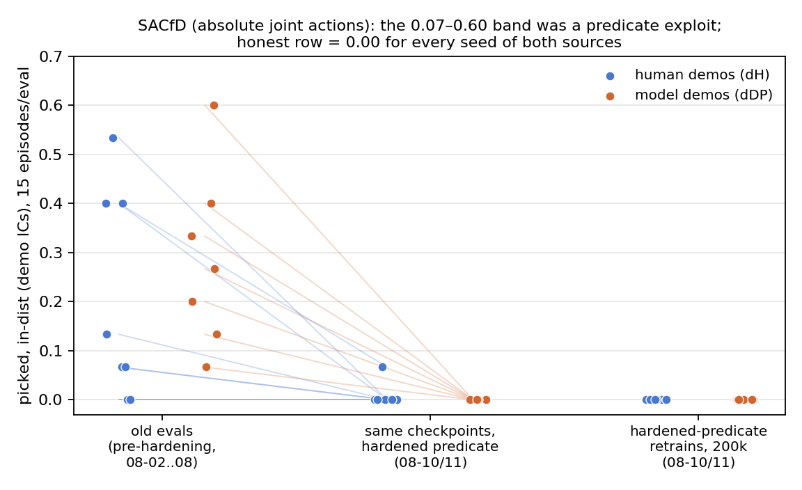
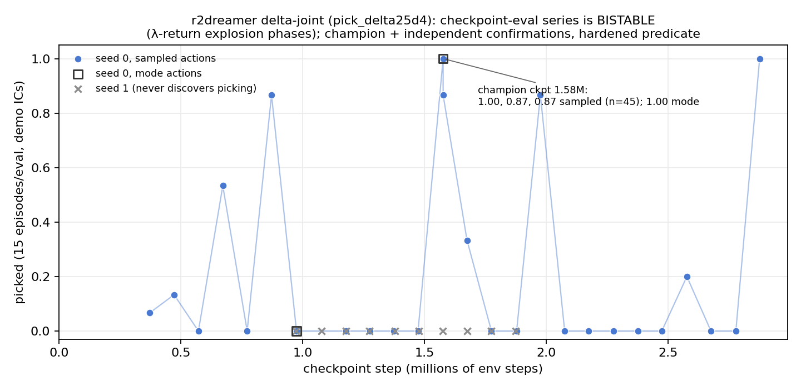

# Full d{source}_{algorithm} matrix — results as of 2026-08-11

All numbers pulled fresh from wandb (entity `jambotime`) on 2026-08-11 by
`analysis/make_matrix_figs_20260811.py` (which also renders the figures and
writes the raw per-run dump `paper/results_matrix_2026-08-11_numbers.json`).
Projects: `genesis_paper` (BC + SACfD rows), `dreamer_v3` (dv3 rows),
`r2dreamer_genesis` (r2dreamer row). Metric = `picked`, pick-phase scope.
`eval_indist` = demo ICs (the headline); `eval_random` = support-random ICs
(generalization); never mixed. 15 episodes per eval unless stated (dv3
periodic evals are n=6). BC per-seed detail and the Bayesian analysis live in
`results_core_matrix.md` and `results_significance.md` (untouched by this
update); this file is the complete-matrix snapshot including the
predicate-hardening fallout and the world-model rows.

**The predicate event that reshapes this table:** commit `aa762ac`
(2026-08-09) hardened the pick predicate — the can must RIDE the
end-effector, sustained 10 frames, instead of a single-instant height check
that a can whacked ballistically ("fling") could satisfy. The DP positive
control was byte-identical under the new predicate (PAPER_PLAN decision log
2026-08-10), so the hardening moves nothing for genuine grasps; it zeroes
exploits. Every row below states which predicate its numbers were earned
under.

## Summary matrix (in-dist picked / random picked, demo-IC headline first)

| row | dH (human demos) | dDP (model demos) | n seeds | predicate | status |
|---|---|---|---|---|---|
| BC (DP), evals of record | 0.62 (0.40–0.80) / 0.23 (0.07–0.40) | 0.80 (0.67–0.93) / 0.23 (0.13–0.33) | 8 / 8 | old; **re-confirmed hardened** (0.63 / 0.79 in-dist) | final |
| RLfD (SACfD), absolute joints, hardened retrains | 0.00 / 0.00 every seed | 0.00 / 0.00 every seed | 8 / 7 finished | hardened | final (honest row) |
| RLfD (SACfD), old checkpoints re-evaled | 0.00×7 + one 0.07 / 0.00×8 | 0.00×7 / 0.00×7 | 8 / 7 | hardened | final — old 0.07–0.60 band retracted as fling exploit |
| RLfD (SACfD), delta-joint actions (`-dj`) | — | — | 0 | hardened | **PENDING — no runs in wandb yet** |
| World model, dv3 (absolute actions, pixels) | ~0 (blips ≤ 2/6, none post-hardening) | ~0 (same) | 5 / 3 series | mixed; hardened-era = uniformly 0.00 | instrumented null |
| World model, r2dreamer (delta-joint actions) | **0.91 sampled (n=45) / 1.00 mode** at champion ckpt, demo ICs | — (twin queued) | 1 seed (of 2 local; 1 never learned) | hardened | **headline; official 5-seed×2-source cluster wave launching** |

The r2dreamer number is not seed-mean-comparable to the matrix rows above
(single seed, best-checkpoint protocol, demo ICs only — see row 4 caveats).

---

## Row 1 — BC (Diffusion Policy): dH_DP vs dDP_DP, n=8

Figure: `figs/bc_central_picked_20260811.png`. Bars/whiskers = the evals of
record (runs `d{src}_DP_s{0..7}-eval`, created 2026-08-02..09 — the wave the
Bayesian analysis was computed on). Open diamonds = a second full eval wave
of the SAME 16 checkpoints run 2026-08-10/11 under the hardened predicate
(same run names, later `created`).

| condition | eval | record wave mean (range), per-seed | hardened re-eval mean (range) |
|---|---|---|---|
| dH_DP | in-dist | **0.617 (0.40–0.80)**: .80 .60 .60 .60 .40 .60 .667 .667 | 0.633 (0.47–0.80) |
| dDP_DP | in-dist | **0.800 (0.67–0.93)**: .867 .733 .667 .80 .667 .80 .933 .933 | 0.792 (0.67–0.93) |
| dH_DP | random | **0.233 (0.07–0.40)** | 0.208 (0.13–0.33) |
| dDP_DP | random | **0.225 (0.13–0.33)** | 0.217 (0.13–0.33) |

Verdicts (hierarchical Bayesian, `results_significance.md`, computed on the
record wave): **in-dist P(model > human) = 0.994 — decisive**; random
P = 0.45 (0.446) — no source effect on generalization. The hardened re-eval
wave moves no seed by more than ±0.20 and no mean by more than 0.025 — the BC
rows are grasp, not fling, and stand under the honest predicate.

Caveats: n=8 seeds, 15 episodes/eval; idle-frame-pruning confound (pruned
human DP 0.67–0.80 vs 0.27 unpruned control; model harvests have no idle
frames by construction — a source property); pick-phase scope only; per-seed
diamond-vs-dot differences within a seed are diffusion-sampling eval noise
(same checkpoint, same ICs).

## Row 2 — RLfD (SACfD)

Figure: `figs/sacfd_collapse_20260811.png` — the three-stage collapse, in-dist,
every seed a point; thin lines connect the same checkpoint across old eval →
hardened re-eval.

### 2a. Absolute-action retrains under the hardened predicate (the honest row)

Runs `dH_SACfD_s0..7` / `dDP_SACfD_s0..7` created 2026-08-10T21:43–45Z,
200k steps, cluster; plus their `*-eval` runs (created 2026-08-11).
**Every completed seed of both sources: picked 0.00 in-dist AND 0.00 random**
(`rollout/ep_rew_mean` flat ~0 for the whole 200k). This is the paper's
RLfD-absolute row and the action-geometry control: with a properly
tanh-bounded actor but absolute joint-target actions, exploration thrash
never produces a sustained hold, so the honest predicate never pays out.

Bookkeeping (deviations from the expected clean 16×0.00 — all zeros, but not
all 16 finished): dDP_SACfD_s7 crashed twice (21:45Z and 02:54Z relaunch) and
never finished — **15/16 retrains completed**, all 0.00; the crashed s7 run's
summary also carries 0.00 evals but is not counted. Separate `-eval` runs
exist for 14 checkpoints (dH s1–s7, dDP s0–s6), all 0.00; dH_SACfD_s0 has no
separate post-retrain `-eval` run — its 0.00 comes from the training run's
terminal eval (same eval code, logged in the train run).

### 2b. Old checkpoints re-evaled under the hardened predicate

Runs `d{src}_SACfD_s{n}-hardened-eval` (created 2026-08-10T22:11Z –
2026-08-11T04:46Z), evaluating the checkpoints behind the previously reported
band:

| | old evals (pre-hardening, 08-02..08) in-dist | hardened re-eval in-dist | hardened re-eval random |
|---|---|---|---|
| dH s0–s7 | 0.40 0.53 0.13 0.40 0.00 0.00 0.07 0.07 | 0 0 0 **0.067** 0 0 0 0 | 0 ×8 |
| dDP s0–s6 | 0.07 0.13 0.60 0.33 0.27 0.20 0.40 | 0 ×7 | 0 ×7 |

**Framing (PAPER_PLAN decision log 2026-08-10): the previously reported
SACfD band of 0.07–0.60 was a predicate exploit top to bottom** — the
policies fling the can airborne within ~6–11 steps of reset; the
single-instant height predicate counted it, the harvest pipeline's
minimum-length guard (independently) rejected 320/320 of the resulting
"successes", which is how the exploit was caught. Residual signal after
hardening: one seed (dH s3) at 0.067 = 1/15 episodes. dDP_SACfD_s7 was never
trained in the original wave (that row was always n=7).

### 2c. Delta-joint SACfD (`-dj` wave) — PENDING

Zero runs matching `-dj` exist in wandb as of this pull. The delta-action
SACfD wave (per-step joint deltas capped at demo p99 speed — the same
geometry fix that unlocked r2dreamer, decision log 2026-08-11 "SACfD moves to
delta-joint actions") is launched-but-unreported. **No numbers exist; nothing
here is a placeholder for them.** This is the experiment that tests whether
the action-geometry story (Section: synthesis) transfers to the RLfD class.
(For completeness: the wave-2 `dSACfD_*` student conditions visible in wandb
— `dSACfD_DP_*` all failed at launch, `dSACfD_SACfD_*` all 0.00 — are the
DOA descendants of the fling teacher and are not a matrix row.)

## Row 3 — World model, dv3 (absolute actions, pixels): instrumented null

Project `dreamer_v3`, training runs `genesis_pixels_d{src}_DV3_s*-joint`,
periodic eval runs `d{src}_DV3_s{n}-eval-step{N}` (key `policy_eval/picked`,
n=6 episodes each). Per standing caveat 6, all evals used here postdate the
2026-08-01 scope-restore harness fix (earliest included: 2026-08-02); the
dDP evals of 08-02/03 predate the 2026-08-08 action-conditioning fix and are
flagged as such below.

| series | # evals | max ckpt step | nonzero evals (step → picked) |
|---|---|---|---|
| dH_DV3_s3 | 28 | 3.03M | 5 blips of 1/6 (302k…2.08M) |
| dH_DV3_s4 | 13 | 1.39M | 2 blips of 1/6 (232k, 322k) |
| dH_DV3_s5 | 16 | 1.59M | none |
| dH_DV3_s6 | 23 | 2.62M | 11 blips: 9× 1/6, 2× 2/6 (290k…2.25M) |
| dH_DV3_s7 | 35 | 3.81M | 10 blips: 9× 1/6, 1× 2/6 (52k…2.58M) |
| dDP_DV3_s0 | 12 | 1.01M | 1 blip of 1/6 (182k) [pre-08-08 fix] |
| dDP_DV3_s1 | 19 | 1.67M | 3 blips (362k 2/6; 682k, 842k 1/6) [pre-08-08 fix] |
| dDP_DV3_s2 | 18 | 1.70M | 5 blips: 4× 1/6, 1× 2/6 (122k…622k) [pre-08-08 fix] |

Reading: **no dv3 series ever exceeds 2/6 in a single eval, none sustains a
nonzero level across consecutive evals, and every one of the 45 evals logged
after the hardened-predicate wave went live on the cluster
(post 2026-08-10T21:00Z) reads 0.00** — through 3.8M steps on the
longest-running series (dH s7). Given that every SACfD "success" of similar
sporadic magnitude proved to be predicate gaming (row 2b), the pre-hardening
blips here are unverified at best; the hardened-era record is uniformly zero.
This is the second arm of the geometry story: dv3 on absolute actions is an
instrumented null, mirrored on both demo sources (H4 degenerately satisfied
at 0 ≈ 0). Nuance vs the "flat ~0 with sporadic 1/6 noise" shorthand: two dH
series (s6, s7) blip in ~30–50% of their pre-hardening evals (still never
above 2/6); the shorthand understates blip frequency, not magnitude.

Caveats: n=6 episodes per periodic eval (a single episode = 0.167); training
continues (dH s4/s5/s7 and dDP s1/s2 alive at pull time); dDP evals listed
pre-08-08 carry the action-conditioning-fix flag; the exact commit at which
the cluster eval harness picked up the hardened predicate is not recoverable
from wandb metadata — the 08-10T21:00Z boundary is inferred from the SACfD
retrain wave demonstrably running hardened code on the cluster from 21:43Z.

## Row 4 — World model, r2dreamer (delta-joint actions): the new headline

Project `r2dreamer_genesis`, run `pick_delta25d4_s0`: r2dreamer with
per-step joint-delta actions capped at 0.025 rad = the demos' p99 per-step
speed, bounded-normal actor with clipped samples, 4× demo duplication +
150k-step demo reinjection — demos consumed as dynamics/reward DATA only.
**No behavior cloning: actor-BC was explicitly excluded by design
(user decision 2026-08-11) to keep the world-model arm imitation-free.**

**Champion: checkpoint at 1.58M env steps (`ckpt_1576820` /
`CHAMPION_1576820.pt`). Confirmation protocol, demo ICs, hardened predicate:
picked 0.91 sampled (41/45 over three independent 15-episode draws:
1.00 `zsv8f97y`, 0.87 `irr8okoj`, 0.87 `975kzneb`) and 1.00 mode-action
(15/15, `ovrhyzry`).** Independent later draws from the same training run:
ckpt 1.976M → 0.87 (`c33o0ffj`), ckpt 2.876M → 1.00 (`e8w4f0qy`). This is
the first fully confirmed world-model policy in the project, and it makes
the world-model row go from null (dv3, r2dreamer-absolute, all earlier
configs — every apparent success a measurement artifact) to
pick-rate-comparable-with-the-best-BC-row by changing the ACTION GEOMETRY,
not the learner.

Figure: `figs/r2dreamer_ckpt_stability_20260811.png` — every valid
checkpoint-eval of `pick_delta25d4_s0` (all eval runs created after
2026-08-11T03:00Z; sample-mode series with mode-action evals as open squares,
seed 1 as gray crosses). Full series (sampled unless noted):

| ckpt step | picked | | ckpt step | picked |
|---|---|---|---|---|
| 372k | 0.07 | | 1.675M | 0.33 |
| 472k | 0.13 | | 1.775M | 0 |
| 572k | 0 | | 1.878M | 0 |
| 672k | **0.53** | | 1.976M | **0.87** |
| 772k | 0 | | 2.076M | 0 |
| 872k | **0.87** | | 2.174M | 0 |
| 975k | 0 (also 0 in mode) | | 2.276M | 0 |
| 1.178M | 0 | | 2.376M | 0 |
| 1.275M | 0 | | 2.474M | 0 |
| 1.373M | 0 | | 2.577M | 0.20 |
| 1.474M | 0 | | 2.676M | 0 |
| **1.577M champion** | **1.00; 0.87, 0.87 (confirm); 1.00 mode** | | 2.778M | 0 |
| | | | 2.876M | **1.00** |

(Also in wandb: one eval of `banked_peak.pt` tagged step-772k → 0.00 — a
checkpoint of uncertain step provenance, listed here, excluded from the plot.)

MANDATORY caveats:

- (a) **Single seed, single machine** (local dev box). The official
  5-seed × 2-source cluster wave is launching now; nothing here is a source
  comparison yet — the dDP twin under this exact recipe is the pending H4
  test.
- (b) **Training is BISTABLE.** Diagnosed λ-return explosion past the known
  max return of 100 (targets observed 130–640): the run alternates between
  competent phases and collapsed phases, so **checkpoints are a phase
  lottery** — hence the best-checkpoint + independent-confirmation protocol
  (three fresh 15-episode draws + one mode draw of the banked champion)
  rather than a last-checkpoint number. The stability figure is the honest
  disclosure of that lottery: 7 of 25 sampled checkpoint-evals are ≥ 0.20,
  interleaved with zeros.
- (c) **A second seed never discovered picking**: `pick_delta25d4_s1` shows
  0.00 at every eval (10 evals, ckpts 0.97M–1.87M; training ran to ~1.9M
  steps). Local P(discovery) = 1/2 across the two local seeds.
- (d) **Demo ICs only** — random-IC generalization of the champion is
  unmeasured.
- (e) **All r2dreamer delta evals logged before 2026-08-11T03:00Z are VOID**
  (silent-default bug: delta policies were evaluated in absolute action
  mode) and are excluded everywhere above. In this project that voids one
  eval of ckpt-372k (0.00, `4acul8jy`, 02:57Z — superseded by the valid
  03:10Z re-eval at 0.07) and the earlier `pick_delta_s0` evals.

## Cross-cutting synthesis

The matrix's cleanest cross-cutting fact is that **action-space geometry
interacts with EXPLORATION, not imitation**. The only learner that thrives on
absolute joint targets is the one that never explores: Diffusion Policy
imitates demonstrated absolute-joint trajectories at 0.62–0.80 in-dist
(row 1). Every learner that has to DISCOVER behavior in that same
absolute-action space failed honestly — SACfD's 15 hardened retrains are
0.00×15 with reward flat from step zero (row 2a), dv3 is an instrumented
null through 3.8M steps (row 3), and r2dreamer's absolute-control variant
collapsed the same way (0/2479 episodes; decision log 2026-08-10) — because
random exploration over absolute joint targets produces flailing that the
sustained-hold predicate never rewards (the un-hardened predicate DID reward
it, which is exactly the 0.07–0.60 fling band of row 2b). When the same
r2dreamer recipe's actions became per-step deltas capped at the
demonstrations' p99 speed — with demos consumed as data only (4×
duplication + 150k reinjection, NO behavior cloning) — the world-model arm
went from null to 0.91/1.00 at the champion checkpoint (row 4): the
geometry change puts random actions in the regime of small smooth motions
where grasp-adjacent experience is reachable, and the world model does the
rest. The pending delta-SACfD wave (row 2c) tests whether the same
geometry fix rescues the model-free RLfD class; the launching 5-seed × 2-source
r2dreamer wave turns row 4 from an existence proof into the H4 comparison.

## Where wandb disagrees with prior summaries (flags, not silently resolved)

1. **r2dreamer stability series has MORE nonzero checkpoints than the series
   circulating in the 08-11 handoff notes.** The approximate series
   ("0.07, 0.13, 0,0,0,0,0, 1.00, …") lists zeros at ckpts 672k and 872k;
   wandb shows **672k → 0.53** (`1l4vfx8o`) and **872k → 0.87** (`eduxdzgd`).
   Both are valid post-03:00Z evals. This strengthens (not weakens) the
   bistability picture — the competent phase was visited before 1M steps —
   but any text quoting the 16-value series should be corrected to the
   25-checkpoint table above.
2. **The SACfD retrain wave is 15×0.00, not 16×0.00**: `dDP_SACfD_s7`
   crashed at launch (21:45Z) and again on relaunch (02:54Z) and has no
   finished training run or eval run. Every completed run is 0.00, so the
   scientific conclusion is unchanged, but the count in the paper should be
   n=8 (dH) + n=7 (dDP).
3. **`dH_SACfD_s0` (retrain) has no standalone `-eval` run** — its 0.00 is
   the training run's terminal eval. Same eval code path; provenance noted.
4. **dv3 "sporadic 1/6 noise" understates blip frequency for dH s6/s7**
   (11/23 and 10/35 pre-hardening evals nonzero, max 2/6). Magnitude claim
   holds; frequency wording should be per the row-3 table.
5. **BC re-eval wave (2026-08-10/11) is new relative to
   `results_core_matrix.md`** (pulled 08-09): a full hardened-predicate
   re-eval of all 16 DP checkpoints now exists under the same run names.
   It confirms the row (means move ≤ 0.025) and is reported here as the
   robustness check; the Bayesian verdicts still refer to the record wave.
   Everything checked against the given handoff numbers otherwise matches:
   hardened re-evals 14×0 + one 0.067 (dH s3) ✓; champion confirmations
   1.00/0.87/0.87 + 1.00 mode = 0.91 sampled (n=45) ✓; later draws 0.87 at
   1.98M and 1.00 at 2.88M ✓; no `-dj` runs ✓; BC P=0.994 / P=0.45 ✓.
