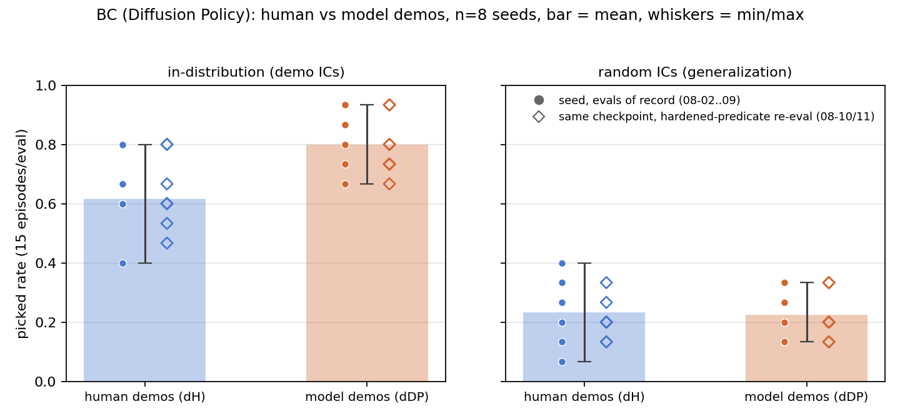
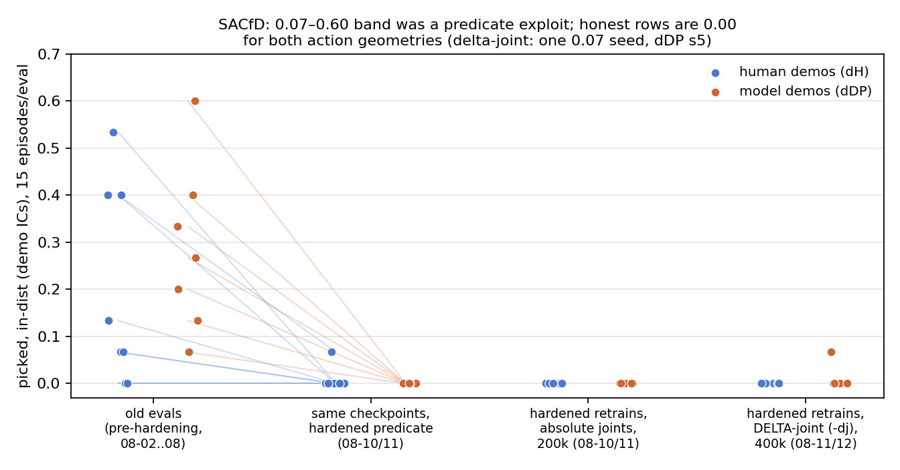
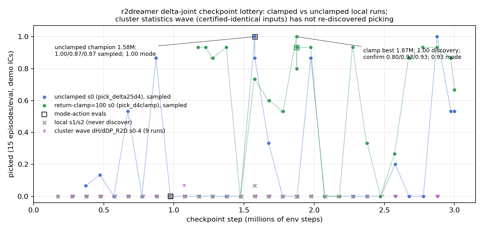

# Full d{source}_{algorithm} matrix — results as of 2026-08-12

Supersedes [results_matrix_2026-08-11.md](results_matrix_2026-08-11.md) (kept
for the record; its BC/dv3/SACfD-absolute analysis is carried forward and was
re-verified fresh, not copied). All numbers pulled fresh from wandb (entity
`jambotime`) on 2026-08-12 by `analysis/make_matrix_figs_20260812.py`, which
also renders the figures and writes the raw per-run dump
`paper/results_matrix_2026-08-12_numbers.json`. Projects: `genesis_paper`
(BC + SACfD rows), `dreamer_v3` (dv3 rows), `r2dreamer_genesis` (r2dreamer
local runs + the cluster statistics wave). Local r2dreamer TRAINING metrics
(train-episode success, discovery timing, the clamp run's return statistics)
are NOT in wandb and are read from `~/workspace/r2dreamer/runs/*/metrics.jsonl`
— those numbers are labeled local. Metric = `picked`, pick-phase scope.
`eval_indist` = demo ICs (the headline); `eval_random` = support-random ICs
(generalization); never mixed. 15 episodes per eval unless stated (dv3
periodic evals are n=6). All numbers below are hardened-predicate
(`aa762ac`, sustained 10-frame ride) unless a row says otherwise.

**New since 2026-08-11:** (1) the SACfD delta-joint (`-dj`) wave has numbers
— it does NOT rescue model-free RLfD at this budget; (2) the r2dreamer
return-clamp ablation (`pick_d4clamp_s0`) completed at 3M with a CONFIRMED
second champion and a durability win; (3) the cluster r2dreamer statistics
wave (certified-identical inputs) is 4-complete-at-3M with ZERO discoveries —
the local 2-for-2 first impression was the tail of the distribution;
(4) dv3 series extended (dH s7 now through 4.87M steps), still an
instrumented null.

## Summary matrix (in-dist picked / random picked, demo-IC headline first)

| row | dH (human demos) | dDP (model demos) | n seeds | status |
|---|---|---|---|---|
| BC (DP), evals of record | 0.62 (0.40–0.80) / 0.23 (0.07–0.40) | 0.80 (0.67–0.93) / 0.23 (0.13–0.33) | 8 / 8 | final (re-verified unchanged 08-12) |
| RLfD (SACfD), absolute joints, hardened retrains | 0.00 / 0.00 every seed | 0.00 / 0.00 every seed | 8 / 7 finished | final (honest row) |
| RLfD (SACfD), **delta-joint (`-dj`), 400k, cap 0.025** | **0.00 / 0.00 every seed (n=8)** | **0.00 ×5 + one 0.067 in-dist (s5) / 0.00 ×6** | 8 / 6 finished (+2 running) | delta geometry does NOT rescue model-free RLfD at this budget |
| World model, dv3 (absolute actions, pixels) | ~0 (blips ≤ 2/6, none post-hardening; longest series now 4.87M) | ~0 (same) | 5 / 3 series | instrumented null |
| World model, r2dreamer local (delta-joint) | champion 0.91 sampled (n=45) / 1.00 mode @1.577M (unclamped); **clamp ablation: 0.89 sampled (n=45) / 0.93 mode @1.875M** | — | 2 discoveries / 4 local runs | two confirmed champions; discovery is stochastic |
| World model, r2dreamer CLUSTER wave (certified-identical) | 0.00 everywhere except one 1/15 blip (dH s3 @1.07M) | 0.00 everywhere | 4 synced / 5 synced (of 5+5 launched) | 4 complete at 3M, ZERO discoveries; rest in flight |

The r2dreamer numbers are not seed-mean-comparable to the top rows (single-run
best-checkpoint protocol, demo ICs only — see row 4/5 caveats).

---

## Row 1 — BC (Diffusion Policy): dH_DP vs dDP_DP, n=8 — carried forward

Figure `figs/bc_central_picked_20260811.png` carried over unchanged; the
08-12 pull reproduces every per-seed number of both eval waves exactly
(verified value-for-value against the 08-11 dump — see
`results_matrix_2026-08-12_numbers.json` `bc`).

| condition | eval | record wave mean (range) | hardened re-eval mean (range) |
|---|---|---|---|
| dH_DP | in-dist | **0.617 (0.40–0.80)** | 0.633 (0.47–0.80) |
| dDP_DP | in-dist | **0.800 (0.67–0.93)** | 0.792 (0.67–0.93) |
| dH_DP | random | **0.233 (0.07–0.40)** | 0.208 (0.13–0.33) |
| dDP_DP | random | **0.225 (0.13–0.33)** | 0.217 (0.13–0.33) |

Verdicts (hierarchical Bayesian, `results_significance.md`, record wave):
in-dist P(model > human) = 0.994 — decisive; random P = 0.45 — no source
effect on generalization. Caveats as in the 08-11 doc: n=8 seeds, 15
episodes/eval; idle-frame-pruning confound (pruned human DP 0.67–0.80 vs 0.27
unpruned control; model harvests have no idle frames by construction — a
source property); pick-phase scope only.

## Row 2 — RLfD (SACfD)

Figure `figs/sacfd_collapse_20260812.png` (supersedes
`sacfd_collapse_20260811.png`) — now FOUR stages, in-dist, every seed a
point: old-predicate evals → hardened re-evals of the same checkpoints →
hardened absolute-joint retrains → hardened **delta-joint** retrains.

### 2a. Absolute-action retrains (unchanged from 08-11, re-verified)

Runs `d{src}_SACfD_s0..7` (created 2026-08-10T21:43–45Z, 200k steps):
**every completed seed of both sources 0.00 in-dist AND 0.00 random**;
15/16 completed (dDP_s7 crashed twice, still no finished run — its partial
summary also reads 0.00 but is not counted); `dH_SACfD_s0`'s 0.00 is the
training run's terminal eval (no standalone `-eval` run). Old checkpoints
re-evaled hardened: 14×0.00 + one 0.067 (dH s3); the previously reported
0.07–0.60 band stands retracted as a fling exploit (PAPER_PLAN decision log
2026-08-10).

### 2b. Delta-joint retrains (`-dj`) — NEW, the action-geometry transfer test

Runs `d{src}_SACfD-dj_s{n}` in `genesis_paper`, 400k steps, per-step
joint-delta actions capped at 0.025 rad = demo p99 speed (the identical
geometry that unlocked r2dreamer; launch decision PAPER_PLAN 2026-08-11
"SACfD moves to delta-joint actions"). Status at pull:

| condition | train finished | evals | in-dist | random | train reward |
|---|---|---|---|---|---|
| dH_SACfD-dj s0–s7 | **8/8** | 8/8 | **0.00 ×8** | **0.00 ×8** | `rollout/ep_rew_mean` terminal 0.00 ×8 |
| dDP_SACfD-dj s0–s7 | **6/8** (s6, s7 running, created 08-12T03:21Z) | 6/6 finished | **0.00 ×5 + one 0.067 (s5)** | **0.00 ×6** | terminal 0.00 ×4, s4 = 0.03, s5 = 0.02 |

**Framing: delta-action geometry does NOT rescue model-free RLfD at this
budget.** The difference from the absolute row is qualitative but tiny:
absolute SACfD was absolute zero everywhere (train reward flat 0.00 from
step one); delta SACfD occasionally earns genuine picks — nonzero terminal
train reward on dDP s4/s5 and one 1/15 in-dist eval success (dDP s5,
`dDP_SACfD-dj_s5-eval`, 08-12T07:36Z) — but never converts them into a
policy. So the geometry fix that took r2dreamer from null to champion moves
SACfD only from "never picks" to "picks ~once per 15-episode eval on its
best seed": the world model, not the action space alone, is doing the work.
Caveats: dDP n=6 of 8 (two seeds still training at pull time — this row's
dDP side is provisional until they land); 400k steps is 2× the absolute row's
budget but not a convergence guarantee; single eval per seed.

## Row 3 — World model, dv3 (absolute actions, pixels): instrumented null

Project `dreamer_v3`, periodic eval runs `d{src}_DV3_s{n}-eval-step{N}`
(`policy_eval/picked`, n=6 episodes each; evals before the 2026-08-01
scope-restore fix excluded; dDP evals of 08-02/03 predate the 08-08
action-conditioning fix and stay flagged). Updated series (step ranges
extended since 08-11):

| series | # evals | max ckpt step | nonzero evals (all pre-hardening) |
|---|---|---|---|
| dH_DV3_s3 | 28 | 3.03M | 5 blips of 1/6 (302k…2.08M) |
| dH_DV3_s4 | 21 | 2.34M | 2 blips of 1/6 (232k, 322k) |
| dH_DV3_s5 | 25 | 2.65M | none |
| dH_DV3_s6 | 23 | 2.62M | 11 blips: 9× 1/6, 2× 2/6 (290k…2.25M) |
| dH_DV3_s7 | **44** | **4.87M** | 10 blips: 9× 1/6, 1× 2/6 (52k…2.58M) |
| dDP_DV3_s0 | 12 | 1.01M | 1 blip of 1/6 (182k) [pre-08-08 fix] |
| dDP_DV3_s1 | 28 | 2.67M | 3 blips (362k 2/6; 682k, 842k 1/6) [pre-08-08 fix] |
| dDP_DV3_s2 | 27 | 2.71M | 5 blips: 4× 1/6, 1× 2/6 (122k…622k) [pre-08-08 fix] |

Reading unchanged, evidence stronger: **no series ever exceeds 2/6, no
nonzero level is ever sustained, and every one of the 89 evals logged after
the hardened-predicate wave went live (post 2026-08-10T21:00Z; was 45 at the
08-11 pull) reads 0.00** — now through 4.87M steps on dH s7. All new evals
since 08-11 are zeros; no new blips anywhere. Caveats as before: n=6
episodes/eval (one episode = 0.167); several series still training; the
08-10T21:00Z hardened-code boundary is inferred, not recorded in wandb
metadata.

## Row 4 — World model, r2dreamer local (delta-joint): two confirmed champions

Figure `figs/r2dreamer_ckpt_lottery_20260812.png` (supersedes
`r2dreamer_ckpt_stability_20260811.png`): both local 3M runs' checkpoint-eval
series overlaid (unclamped blue, return-clamp green), local never-discovering
seeds s1/s2 as crosses, and the cluster wave's periodic evals as triangles.
All points are valid post-08-11T03:00Z evals (earlier delta evals VOID —
absolute-mode eval bug); no smoothing; repeated draws of the same checkpoint
(champion/best confirmations) are all plotted.

### 4a. `pick_delta25d4_s0` (unclamped champion run) — complete at 3M

Champion unchanged: **ckpt 1.577M → picked 0.91 sampled (41/45; draws
1.00/0.87/0.87) and 1.00 mode (15/15), demo ICs, hardened predicate**
(runs `zsv8f97y`/`irr8okoj`/`975kzneb`/`ovrhyzry`). The checkpoint-eval
series now extends to the end of the run — **27 unique checkpoints evaled,
11 nonzero** (first draw per checkpoint; the final ~3.0M checkpoint counted
once though drawn twice, 0.53 both times):

372k 0.07 · 472k 0.13 · 572k 0 · 672k 0.53 · 772k 0 · 872k 0.87 · 975k 0
(0 in mode too) · 1.178M 0 · 1.275M 0 · 1.373M 0 · 1.474M 0 ·
**1.577M 1.00 (champion; confirms 0.87/0.87 + 1.00 mode)** · 1.675M 0.33 ·
1.775M 0 · 1.878M 0 · 1.976M 0.87 · 2.076M 0 · 2.174M 0 · 2.276M 0 ·
2.376M 0 · 2.474M 0 · 2.577M 0.20 · 2.676M 0 · 2.778M 0 · 2.876M 1.00 ·
2.975M 0.53 · ~3.0M 0.53, 0.53

New vs the 08-11 doc: the three end-of-run draws (2.975M and the final
checkpoint twice) all landed nonzero at 0.53 — the run ENDED in a competent
phase. (The 08-11 doc's 25-checkpoint table, 9 nonzero, was the same series
truncated at 2.876M.)

### 4b. `pick_d4clamp_s0` (return_clamp=100 ablation) — COMPLETE at 3M, NEW

Identical recipe with λ-return targets clamped at the known max return of
100. Checkpoint-eval series (checkpoint evals began at 1.17M — no earlier
checkpoints were ever evaled, see caveat below): **20 draws, 16/20 nonzero**
(zeros only at 1.47M, 2.07M, 2.17M, 2.47M):

1.172M 0.93 · 1.272M 0.87 · 1.372M 0.93 · 1.472M 0 · 1.572M 0.73 ·
1.672M 0.60 · 1.772M 0.53 · **1.875M 1.00** · 1.972M 0.93 · 2.072M 0 ·
2.172M 0 · 2.272M 0.93 · 2.372M 0.33 · 2.472M 0 · 2.572M 0.27 ·
2.677M 0.87 · 2.774M 0.93 · 2.875M 0.93 · 2.973M 0.87 · 3.0M 0.67

(The 2.072M value is local-sourced from the run's `metrics.jsonl`; its wandb
eval run crashed after logging. Series pulled from BOTH the training run's
eval curve and the `pick_d4clamp_s0-eval-step*` runs — they agree.)

**Best checkpoint confirmed as a second champion: `ckpt_1875040.pt` →
discovery draw 1.00 (15/15, `921e9x97`, 08-11T23:19Z), then confirmation
0.80/0.93/0.93 sampled = 0.89 (40/45, runs `j0e3zfh4`/`ruai3uw2`/`ke1n13r5`)
+ 0.93 mode (14/15, `ulaytx5m`), created 08-12T05:55–06:00Z.**

**The clamp story has three parts — all three reported:**

1. **The clamp does NOT reduce entropy-collapse cycling.** Spike onsets over
   the matched first 1.1M steps: 15 (unclamped) vs 12 (clamped) per the
   pilot (PAPER_PLAN decision log 2026-08-11 evening); an independent
   recount for this doc (rolling `train/action_entropy` crossings below 30%
   of range, local metrics) gives 16 vs 13 — same conclusion, unchanged.
   **The 08-11-morning claim that clamping would stabilize training was
   retracted** (PAPER_PLAN 08-11 evening: "clamp hypothesis refuted by
   pilot"); this doc cites that retraction rather than re-litigating it.
2. **The clamp does NOT hurt peak performance.** Champion-equivalent:
   0.89 sampled / 0.93 mode (clamped) vs 0.91 sampled / 1.00 mode
   (unclamped) — within eval noise at n=45.
3. **The clamp DOES improve checkpoint durability.** Nonzero checkpoint
   draws: 16/20 (clamped) vs 11/27 (unclamped, full series) — one-sided
   Fisher exact **p = 0.0076**. Because the clamp run has no draws before
   1.17M, the fairest comparison is the matched window ≥ 1.17M: 16/20 vs
   7/20, **p = 0.0048**. Either way the clamped run's competent phases are
   far more likely to survive to a checkpoint.

Mechanism check (local metrics, verified for this doc): the clamp does
eliminate return-target overshoot entirely — `train/ret_replay_max` > 105 in
84.5% of unclamped log rows (max 1974) vs 0.0% clamped (max exactly 100.0).
So the ablation cleanly EXCLUDES return-overshoot as the bistability root
cause: overshoot gone, cycling intact.

### 4c. Local seeds that never discovered — P(discovery) = 2/4 local

- `pick_delta25d4_s1`: killed at 1.91M. All 10 checkpoint evals
  (0.97M–1.87M) = 0.00. Nuance (local metrics): 56/4530 training episodes
  succeeded, clustered 0.21M–1.24M — a transient train-time competence that
  collapsed before the first evaled checkpoint and never returned. Discovery
  is scored at the checkpoint-eval level: never discovered.
- `pick_delta25d4_s2`: STILL RUNNING, at ~2.43M at pull. 24 checkpoint evals:
  23× 0.00 plus **one 0.067 (1/15) at ckpt 1.576M** (`k29cfcz1`,
  08-12T08:05Z). 2/5906 training episodes nonzero. Not a discovery (single
  episode, dv3-blip magnitude), but the row is not literally all-zero — see
  disagreements below.

Discovery timing where discovery exists (local `metrics.jsonl`,
`episode/train_picked`): unclamped s0 — first success at step 228k,
sustained (rolling-50 mean ≥ 0.1) at 339k; clamp — first success 503k,
sustained 692k. (See disagreements: these differ from the 280k/740k figures
in the 08-12 handoff.)

## Row 5 — CLUSTER r2dreamer statistics wave: certified-identical, zero discoveries so far

Runs `dH_R2D_s0-4` / `dDP_R2D_s0-4` in `r2dreamer_genesis` — the official
5-seed × 2-source wave of the exact local recipe. **Input certification
protocol (all passed before launch): demo-set checksums identical to local,
replay gates 3/3 on the cluster (including the dDP set with per-episode
ICs), config field-diff clean, prefill counts exact, fp16 AMP identical.**
Status at pull (env_step = synced progress; NOTE all synced runs show wandb
state "finished" — an offline-sync artifact, progress per `env_step`):

| run | env_step synced | periodic evals (n=15 each) | nonzero | terminal evals |
|---|---|---|---|---|
| dDP_R2D_s0 | **3.0M complete** | 27 | none | `latest.pt` 0.00; `BEST_selected.pt` 0.00 ×3 sampled + 0.00 mode |
| dDP_R2D_s1 | **3.0M complete** | 27 | none | same pattern, all 0.00 |
| dDP_R2D_s2 | **3.0M complete** | 27 | none | same pattern, all 0.00 |
| dDP_R2D_s3 | 1.01M | 23 | none | — |
| dDP_R2D_s4 | 1.50M | 32 | none | — |
| dH_R2D_s0 | 1.22M | 24 | none | — |
| dH_R2D_s1 | **3.0M complete** | 28 | none | same pattern, all 0.00 |
| dH_R2D_s2 | 1.36M | 19 | none | — |
| dH_R2D_s3 | 1.28M | 18 | **one: 0.067 (1/15) @ env_step 1.07M** | — |
| dH_R2D_s4 | not in wandb | — | — | launched late after an NFS flake; nothing synced yet |

**Exactly 4 cluster runs are complete at 3M — all four with zero discovery**,
including their best-checkpoint selection evals (`BEST_selected.pt`, 3
sampled draws + 1 mode draw each, every one 0.00). The only nonzero anywhere
in the wave is the dH_s3 1/15 blip. Five runs are mid-flight (1.0–1.5M
synced); one (dH s4) has not synced.

**Combined P(discovery per 3M run):** runs that have COMPLETED 3M under the
certified recipe family = 6 (local unclamped s0 ✓, local clamp ✓, cluster
dDP s0/s1/s2 ✗, cluster dH s1 ✗) → **2/6**. Counting every launched local +
synced cluster run regardless of progress: 2/13 with a discovery so far
(local s1 killed at 1.9M, local s2 and 5 cluster runs still short of 3M).
**The initial local 2-for-2 (s0 + clamp both discovering) was the tail of
the distribution, not the base rate.** Since every measurable input is
certified identical, whatever separates discovering from non-discovering
runs is either seed luck at this base rate or an unmeasured machine/timing
factor — not the demo data, configs, prefill, or precision.

Caveats: cluster wave incomplete (5-6 of 10 runs still owe steps) — the
per-source H4 comparison is NOT yet closable from this row; demo ICs only;
periodic cluster evals are logged inside the training runs (not separate
eval runs) except the terminal/BEST evals listed.

## Cross-cutting synthesis (updated)

The 08-11 synthesis said action-space geometry interacts with EXPLORATION,
not imitation. The 08-12 data sharpens it in both directions:

1. **Geometry alone is not sufficient: the world model is load-bearing.**
   The delta-joint SACfD wave (row 2b) ran the exact geometry that unlocked
   r2dreamer and got 0.00 across 14 finished seeds (one 1/15 exception),
   with only trace train-time reward. Model-free RLfD fails on absolute
   actions AND on delta actions at this budget; r2dreamer with the same
   delta actions produces confirmed 0.9-champions. The working combination
   is delta geometry + world-model credit assignment.
2. **The world-model result now stands on TWO confirmed local champions**
   (unclamped 0.91/1.00 @1.577M; clamped 0.89/0.93 @1.875M) — it is
   replicated-in-configuration but NOT yet replicated-across-machines: the
   certified cluster wave is 0-for-4 completed 3M runs. Discovery of picking
   is a stochastic event (current best estimate 2/6 per 3M run across
   certified-identical setups), and the paper must present it as such.
3. **Open scientific questions, explicitly:** (a) what drives discovery
   probability — every measurable input is certified identical between the
   discovering and non-discovering machines, so machine/timing factors are
   not excluded but nothing measurable separates them; (b) the bistability
   root cause — the clamp ablation EXCLUDES λ-return overshoot (overshoot
   eliminated, cycling unchanged) while showing overshoot control still buys
   checkpoint durability (16/20 vs 11/27 nonzero draws, p = 0.0076); live
   suspects remain AMP inf-grads and demo-reinjection shocks (PAPER_PLAN
   08-11 evening).

## Where the fresh pull disagrees with the 08-12 handoff numbers (flags, not silently resolved)

1. **Unclamped lottery denominator: 11/27, not "11/25".** The handoff quoted
   "~11/25 nonzero" for `pick_delta25d4_s0`. Fresh pull: 27 unique evaled
   checkpoints, 11 nonzero (12/28 counting the twice-drawn final checkpoint
   as two draws). The numerator matches; the denominator grew because three
   end-of-run draws (2.975M, ~3.0M ×2) landed after the 08-11 doc — and all
   three are NONZERO (0.53), i.e. the run ended competent. The 08-11 doc's
   own table (25 checkpoints, 9 nonzero) was correct for its pull time.
2. **Discovery times: measured 228k/339k and 503k/692k, not "280k, 740k".**
   From local `metrics.jsonl`: unclamped s0 first train success 228k,
   sustained ≥0.1 at 339k; clamp first success 503k, sustained 692k. The
   handoff's 740k is close to the clamp's sustained figure under a wider
   window (748k with a 100-episode window); 280k for s0 falls between first
   success (228k) and sustained (339k) and matches no criterion computed
   here. Discovery-time claims in the paper should use the stated criterion
   + these measured values.
3. **`pick_delta25d4_s2` is not all-zero.** The handoff said s1 and s2
   "never discovered"; true at the discovery level, but s2 logged one 0.067
   (1/15) checkpoint eval at 1.576M today (08:05Z) and is at ~2.43M (handoff
   said ~2.3M). s1 additionally shows a transient train-time competence
   (56 successful train episodes, 0.21–1.24M) that never survived to an
   evaled checkpoint.
4. **Clamp confirmation runs were created 05:55–06:00 UTC, not "~08:0x
   UTC".** Values match exactly (0.80/0.93/0.93 sampled + 0.93 mode of
   `ckpt_1875040.pt`); only the quoted creation time is off. Also note the
   eval-step run NAME says 1872432 (trigger step) while the checkpoint file
   is `ckpt_1875040.pt`.
5. **Cluster completions: exactly 4 at 3M** (handoff said "~4-5") — dDP
   s0/s1/s2 + dH s1. The dH_s3 0.067 blip is confirmed and lives in the
   TRAINING run's periodic eval history (env_step 1.07M), not a separate
   eval run. dH_R2D_s4 is entirely absent from wandb (unsynced), and all
   synced cluster runs carry wandb state "finished" regardless of progress
   (offline-sync artifact) — anyone auditing by run state will miscount.
6. **`-dj` exact counts: dH 8/8 finished (all 0.00 both eval modes ✓); dDP
   6/8 finished + evals (s6/s7 still running)** — within the handoff's
   "~6-8". The one nonzero is dDP s5 in-dist 0.067 ✓. Additional finding
   the handoff's "0.00 across train reward" slightly overstates: dDP s4/s5
   terminal `rollout/ep_rew_mean` = 0.03/0.02 (trace genuine picks during
   training); all dH train rewards are 0.00.
7. **Entropy-spike ordering:** PAPER_PLAN (08-11 evening) reports "15 vs 12"
   = unclamped 15, clamped 12 (my recount 16 vs 13 agrees on direction and
   near-equality). The handoff's "12 vs 15" is the same pair reversed;
   either way: unchanged, the clamp does not reduce cycling.
8. Everything else checked against the handoff matches: BC rows byte-identical
   to 08-11 ✓; SACfD-absolute unchanged (15/16 finished, dDP_s7 still
   crashed) ✓; dv3 uniformly 0.00 post-hardening, dH s7 past 4.8M (4.87M) ✓;
   clamp series 16/20 nonzero ✓ vs unclamped, Fisher p < 0.01 ✓; champion
   numbers unchanged ✓; cluster certification protocol as documented ✓.
